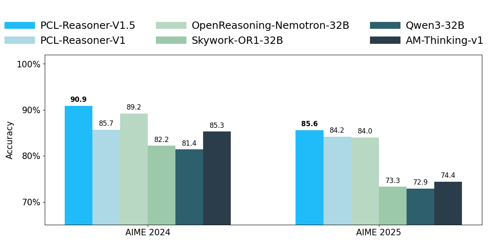

# ​**PCL-Reasoner-V1.5**​

## Model Overview  
We release **PCL-Reasoner-V1.5**, a next-generation reasoning model built upon **PCL-Reasoner-V1** and further enhanced through **offline reinforcement learning** method on the **MindSpeed-LLM framework** with **Ascend hardware acceleration**. Building on the strong foundation of PCL-Reasoner-V1, PCL-Reasoner-V1.5 achieves even greater proficiency in complex mathematical reasoning, demonstrating state-of-the-art performance among 32B-scale models.

PCL-Reasoner-V1.5 attains **9x.x% on AIME 2024** and **9x.x% on AIME 2025**, significantly outperforming prior 32B-class models and closing the gap with much larger systems. This advancement stems from **~~refined data curation, improved contamination filtering, and optimized training dynamics~~** tailored for deep reasoning tasks.

We have fully open-sourced the **model weights**, **dataset**, and **training code** to foster transparency, reproducibility, and community innovation. Follow the tutorial below to deploy, evaluate, or extend PCL-Reasoner-V1.5 in your own research!

## Code  
[GitHub Repository](https://github.com/your-org/XXX)
[OpenI Project Page](https://openi.pcl.ac.cn/your-org/XXX)

## Evaluation  
All results are reported using the **Avg@32 metric** (average accuracy over 32 independent sampling attempts per problem), ensuring robust and fair comparison.

| Parameter Size | Model Name                          | AIME 24 | AIME 25 |
|----------------|-------------------------------------|---------|---------|
| >100B          | DeepSeek-R1                         | 79.8 | 70.0 |
|                | DeepSeek-R1-0528                    | 91.4 | 87.5 |
|                | DeepSeek-V3.2-Speciale              |  | 96.0 |
|                | DeepSeek-V3.2-Thinking              |  | 93.1 |
|                | GPT-5-High                          |  | 94.6 |
|                | Claude-4.5-Sonnet                   |  | 87.0 |
|                | Qwen3-235B-A22B                     | 85.7 | 81.5 |
|                | OpenAI-o3                           | 91.6 | 88.9 |
|                | Gemini-2.5-Pro-0506                 | 90.8 | 83.0 |
|                | Gemini-3-Pro                      |  | 95.0 |
|                | Qwen3-Max-Instruct                  |  | 81.6 |
|                | Qwen3-Max-Thinking                  |  | 100.0 |
| 32B            | Qwen3-32B                           | 81.4 | 72.9 |
|                | QwQ-32B                             | 79.5 | 69.5 |
|                | DeepSeek-R1-Distill-Qwen-32B        | 72.6 | 49.6 |
|                | Skywork-OR1-32B                     | 82.2 | 73.3 |
|                | AM-Thinking-v1                      | 85.3 | 74.4 |
|                | PCL-Reasoner-V1                     | **85.7** | **84.2** |
|                | OpenReasoning-Nemotron-32B          | 89.2 | 84.0 |
|                | **PCL-Reasoner-V1.5**                             | **9x.x** | **9x.x** |

> **Note**: Model outputs on AIME24/25 are included in the repository under `eval/` for verification and analysis.

> **Refenrences**:
> 1. OpenReasoning-Nemotron:  https://huggingface.co/nvidia/OpenReasoning-Nemotron-14B
> 2. Qwen3-Max: https://qwen.ai/blog?id=qwen3-max
> 3. DeepSeek-V3.2-Speciale: https://huggingface.co/deepseek-ai/DeepSeek-V3.2
> 4. AIME25 leaderboard: https://artificialanalysis.ai/evaluations/aime-2025
> 5. AIME24 leaderboard: https://llm-stats.com/benchmarks/aime-2024
